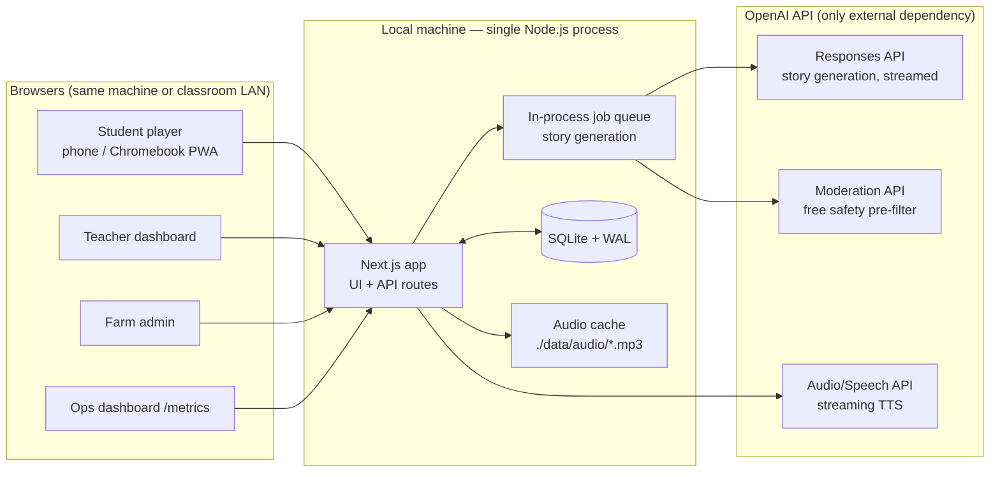
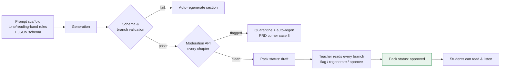

# FarmQuest — Architecture Design & Implementation Plan

**Version:** 1.0 · **Companion to:** [PRD.md](./PRD.md)
**Deployment constraint:** local-only (single machine, no cloud deploy), fully functional with **live OpenAI API calls**.

---

## 1. Design Summary

FarmQuest runs as **one local monolith**: a single Node.js (Next.js) process serving the student
player, teacher dashboard, farm admin, and API — backed by **SQLite** on disk. The only network
dependency is the OpenAI API (stories, moderation, and TTS). Everything else — auth, data,
metrics, audio caching — lives on the local machine.



**Why this shape**

| Requirement | Design answer |
|---|---|
| Local-only, simple to build | One process, one repo, one `npm run dev`. SQLite = zero-admin DB, a single file in `./data/`. |
| Live AI calls | Server-side OpenAI SDK; API key in `.env`. Students/teachers never hold the key. |
| Fast generation + streaming TTS | Server-Sent Events stream story text token-by-token to the teacher; TTS audio is streamed (chunked transfer) from OpenAI through the server to the student, and cached to disk so each chapter is synthesized **once**. |
| A teaching hour of load | ~30–150 concurrent readers is static-file + SQLite-read territory; a laptop handles it easily. The expensive paths (generation, TTS synthesis) are queued and cached, not per-student. |
| Safety for K-12 | Layered pipeline (schema-constrained prompts → Moderation API → teacher approval gate) with the PRD's hard invariant enforced in the data model: students can only ever read `approved` content. |
| Observability | Every generation/TTS/read event writes a row to a local `metrics` table; a `/ops` page charts latency and completion rate. No external telemetry. |

---

## 2. Tech Stack

| Layer | Choice | Rationale |
|---|---|---|
| App framework | **Next.js 15 (App Router), TypeScript** | UI + API routes + SSE in one process; PWA support for offline farm play. |
| Database | **SQLite (WAL mode) via Drizzle ORM** | Single file, safe concurrent reads, typed schema, trivial backup (`cp data/farmquest.db`). |
| Job queue | **In-process queue (p-queue), jobs persisted to a `jobs` table** | No Redis/worker infra; survives restarts by re-reading pending jobs. Concurrency capped at 2 generation jobs. |
| AI — story | **OpenAI Responses API**, `gpt-4o-mini` class model, **Structured Outputs (JSON schema)**, streaming | Cheap, fast, schema-guaranteed branching structure; streamed for perceived speed. |
| AI — safety | **OpenAI Moderation API** (`omni-moderation-latest`) | Free; run on every generated chapter before it reaches teacher review. |
| AI — TTS | **OpenAI Speech API** (`gpt-4o-mini-tts`), streamed MP3, cached to disk | Read-aloud accessibility (IEP/low-reading-level support from PRD corner case #13). |
| Auth | **Session cookies; teacher/farmer accounts with scrypt-hashed passwords; students join via class code + nickname** | No external IdP; matches PRD's no-student-PII posture. |
| Metrics | **Local `metrics` table + `/ops` dashboard (server-rendered charts)** | Zero external services. |
| Logs | **Pino → stdout + `./data/logs/app.log`** | Grep-able, local. |

Repo layout:

```
farmquest/
├── src/
│   ├── app/                    # Next.js routes
│   │   ├── (student)/play/     # join, chapter reader, choices, QR resolver
│   │   ├── (teacher)/dash/     # trip wizard, pack review, approval, live check-in
│   │   ├── (farm)/farm/        # farm profile & stations, QR sign PDFs
│   │   ├── ops/                # metrics dashboard
│   │   └── api/                # route handlers (below)
│   ├── core/
│   │   ├── story/              # generation prompts, JSON schema, branch validator
│   │   ├── safety/             # moderation pipeline, approval gate
│   │   ├── tts/                # streaming synth + disk cache
│   │   ├── queue/              # persistent in-process job queue
│   │   └── metrics/            # event recorder + aggregations
│   ├── db/                     # Drizzle schema + migrations
│   └── lib/                    # auth, sse helpers, ids
├── data/                       # SQLite db, audio cache, logs (gitignored)
├── .env.example                # OPENAI_API_KEY, PORT, MONTHLY_BUDGET_CENTS
└── package.json                # dev / start / db:migrate / seed
```

---

## 3. Data Model

The PRD forbids student PII. The new requirement for "student profiles" is met with
**pseudonymous profiles**: a student picks a nickname and avatar inside a class; nothing else is
collected. Teacher and farmer accounts are real (they're adults and need logins).

```mermaid
erDiagram
  TEACHER ||--o{ CLASS : owns
  FARMER ||--|| FARM : manages
  FARM ||--o{ STATION : has
  CLASS ||--o{ TRIP : schedules
  FARM ||--o{ TRIP : hosts
  TRIP ||--|| STORY_PACK : uses
  STORY_PACK ||--o{ CHAPTER : contains
  CHAPTER ||--o{ CHOICE_OPTION : offers
  CLASS ||--o{ STUDENT_PROFILE : enrolls
  TRIP ||--o{ GROUP : divides_into
  STUDENT_PROFILE }o--o{ GROUP : joins
  GROUP ||--o{ CHOICE_EVENT : makes
  GROUP ||--o{ SAVED_STORY : archives
  CHAPTER ||--o{ AUDIO_ASSET : narrated_by

  TEACHER { id pk; email; password_hash; name; created_at }
  FARMER { id pk; email; password_hash; name; created_at }
  FARM { id pk; farmer_id fk; name; description; facts_json }
  STATION { id pk; farm_id fk; name; slug; qr_token unique; facts_json; sort_order }
  CLASS { id pk; teacher_id fk; name; grade_band "68|912"; join_code unique }
  STUDENT_PROFILE { id pk; class_id fk; nickname; avatar; grade_band; created_at }
  TRIP { id pk; class_id fk; farm_id fk; date; subject_focus_json; status }
  STORY_PACK { id pk; trip_id fk; status "generating|draft|approved|retired"; model; prompt_version; approved_at; approved_by fk }
  CHAPTER { id pk; pack_id fk; phase "pre|onsite|post"; station_id fk nullable; title; body_md; reading_band; moderation_json; teacher_flag }
  CHOICE_OPTION { id pk; chapter_id fk; label; next_chapter_id fk; state_effects_json }
  GROUP { id pk; trip_id fk; code unique; name }
  CHOICE_EVENT { id pk; group_id fk; chapter_id fk; option_id fk; made_at; synced_at }
  SAVED_STORY { id pk; group_id fk; pack_id fk; path_json; ending_chapter_id fk; reflections_json; completed_at }
  AUDIO_ASSET { id pk; chapter_id fk; voice; file_path; duration_s; bytes; created_at }
  METRIC_EVENT { id pk; kind; trip_id fk nullable; pack_id fk nullable; group_id fk nullable; value_num; meta_json; at }
  JOB { id pk; kind "generate_pack|regen_section|synth_audio"; payload_json; status; attempts; error; created_at; finished_at }
```

Key modeling decisions:

- **`SAVED_STORY` is the replay artifact.** It freezes the group's path (`path_json` = ordered
  chapter+choice ids) and reflections at completion, so students and parents can re-read the
  exact branch taken even if the pack is later regenerated or retired (PRD parent journey).
- **The approval gate is structural.** Student-facing queries join through
  `STORY_PACK.status = 'approved'` in a single repository function — there is no code path that
  serves a `draft` chapter to a student route. This enforces the PRD's "0 unreviewed AI text"
  invariant at the data layer, not by discipline.
- **Grade bands, not birthdays.** `68 | 912` on class and profile drives reading level; no ages
  or names are stored for minors.
- **`STATION.qr_token`** is a random slug baked into the printed QR sign
  (`/play/scan/<qr_token>`); permanent per station, class-agnostic — the group cookie decides
  which pack/chapter it resolves to (PRD corner case #18: two classes, same farm, same day).

---

## 4. API Surface (route handlers)

| Route | Method | Auth | Purpose |
|---|---|---|---|
| `/api/auth/login`, `/logout`, `/register` | POST | — / session | Teacher & farmer accounts. |
| `/api/class/:joinCode/join` | POST | none (code) | Student creates pseudonymous profile `{nickname, avatar}`; sets signed group/profile cookie. |
| `/api/trips` | POST/GET | teacher | Trip wizard: farm, date, grade band, subject focus → enqueues `generate_pack`. |
| `/api/packs/:id/stream` | GET (SSE) | teacher | Live generation progress: chapters stream in token-by-token as the model writes them. |
| `/api/packs/:id/chapters/:cid/regenerate` | POST | teacher | Synchronous single-section regen (<60 s target). |
| `/api/packs/:id/approve` | POST | teacher | Flips `draft → approved`; records approver + timestamp; enqueues TTS pre-synthesis. |
| `/api/play/scan/:qrToken` | GET | group cookie | Resolves station + group state → correct chapter (offline: handled by service worker from cache). |
| `/api/play/choice` | POST | group cookie | Records a `CHOICE_EVENT`; idempotent per (group, chapter); accepts batched offline sync. |
| `/api/play/pack.bundle` | GET | group cookie | Full approved pack + audio manifest as one JSON bundle for service-worker caching (the PRD's pre-trip cache step). |
| `/api/tts/:chapterId` | GET | group cookie | Streams narration audio. Cache hit → file stream; miss → OpenAI TTS streamed through and tee'd to disk. |
| `/api/trips/:id/checkins` | GET (SSE) | teacher | Live trip-day view: which groups scanned which stations. |
| `/api/trips/:id/export.csv` | GET | teacher | Choices + reflections export. |
| `/api/farms/...` | CRUD | farmer/admin | Farm profile, stations, facts; QR sign PDF generation. |
| `/ops` + `/api/metrics` | GET | teacher/admin | Latency & completion dashboards (Section 8). |

---

## 5. Performance: fast generation + streaming TTS

### 5.1 Story generation (teacher-facing — the only heavy write path)

1. **Streamed, structured generation.** The trip wizard enqueues a `generate_pack` job. The
   worker calls the Responses API with **Structured Outputs** pinned to the branching-pack JSON
   schema and `stream: true`. Chapters are parsed incrementally from the stream and upserted as
   they complete, so the teacher's review screen (subscribed to `/api/packs/:id/stream` via SSE)
   shows the story *appearing live* — first readable chapter in **~5–15 s**, full pack in
   **~1–3 min** (vs. the PRD's overnight batch; we keep batch as a cost fallback, see 5.4).
2. **Fan-out for big packs.** One "spine" call generates the outline + chapter stubs; then up to
   2 parallel calls flesh out branches. Parallelism is capped by the queue so a laptop and the
   API rate limits stay comfortable.
3. **Section regen is synchronous** (single chapter, small prompt, streamed): p50 well under the
   60 s PRD target.
4. **Students never wait on the model.** Play reads pre-generated rows / the cached bundle —
   student-path latency is a SQLite read (<5 ms) or a service-worker cache hit (0 network).

### 5.2 Streaming TTS (student-facing)

- **Endpoint:** `GET /api/tts/:chapterId` (approved chapters only).
- **First request** for a chapter: server calls OpenAI Speech with streaming response and
  **tees** the byte stream — chunks flow to the student immediately (`Transfer-Encoding:
  chunked`, audio starts in ~1 s) while simultaneously writing `./data/audio/<chapter>.mp3`.
- **Every later request** (the other 29 students): disk file stream. Zero API cost, zero latency.
- **Pre-warm on approval:** approving a pack enqueues `synth_audio` jobs for all chapters, so by
  trip day the cache is fully warm and TTS works **offline** — the audio manifest is part of
  `pack.bundle` and cached by the service worker alongside the text.
- Concurrent-miss guard: an in-process per-chapter lock ensures one synthesis even if 30 students
  tap play at once on an uncached chapter.

### 5.3 Performance budgets (extends PRD §6)

| Path | Target |
|---|---|
| First streamed chapter visible to teacher | < 15 s |
| Full pack generated (spine + branches) | < 3 min |
| Section regeneration | < 60 s |
| Student chapter load (LAN, cached) | < 300 ms / < 2 s offline-cache |
| TTS first audio byte (cache miss / hit) | < 2 s / < 100 ms |
| Choice write + ack | < 100 ms |

### 5.4 Cost control (PRD: <$50/mo)

Generation only on teacher action; single synthesis per chapter (cached forever); moderation is
free; `MONTHLY_BUDGET_CENTS` env cap tracked against the `metrics` cost events — the queue
refuses new generation jobs past the cap and the `/ops` page shows spend. Optional
`GENERATION_MODE=batch` flag falls back to the PRD's overnight Batch API for 50% savings.

---

## 6. Scalability: the teaching hour, locally

Load profile: 1–5 classes × ~30 students + teachers + parents re-reading saved stories,
concentrated in a class period. Peak ≈ **150–300 concurrent sessions**, but the workload is
almost entirely **reads of pre-generated content**.

- **Reads scale trivially:** approved packs are served from SQLite (WAL: unlimited concurrent
  readers) plus HTTP cache headers; on-site play doesn't even hit the server (service-worker
  cache). A mid-range laptop sustains thousands of req/s of this shape.
- **Writes are tiny and rare:** choice events (~a few per group per chapter) in a single-row
  transaction; WAL keeps the one-writer path fast. Offline batches sync idempotently
  (unique `(group_id, chapter_id)`).
- **The expensive things don't multiply with students:** generation is per-*class* (queued,
  concurrency 2) and TTS is per-*chapter* (cached). 30 students cost the same API spend as 1.
- **SSE fan-out** (teacher check-in view, pack streaming) is a handful of connections — teachers
  only, not students.
- **Classroom LAN mode:** `npm run start -- --host 0.0.0.0` + the printed join code lets a whole
  class hit the teacher's machine over school Wi-Fi; QR signs can encode the LAN URL for
  same-network on-site demos. (True farm visits rely on the offline bundle, unchanged.)
- **Growth path (not built now):** the monolith splits cleanly later — SQLite → Postgres via
  Drizzle, in-process queue → worker + Redis, audio dir → object storage. Nothing in the local
  design paints us into a corner.

---

## 7. Safety: layered guardrails for K-12



1. **Layer 0 — no student→model path.** Students cannot send any text to the AI. Reflections are
   student-written but go only to the teacher's CSV (PRD). The API key never leaves the server.
2. **Layer 1 — prompt scaffold:** system prompt encodes tone rules (adventurous, wholesome,
   never frightening/violent/romantic; food-system realities handled honestly, age-appropriately,
   non-graphically — PRD corner case #10), reading band, farm facts, and the strict JSON schema.
3. **Layer 2 — automated screen:** structural validation (all branches terminate, no orphan
   chapters) + Moderation API on every chapter; any flag quarantines and regenerates the section
   *before* teacher review. Moderation scores are stored on the chapter row for audit.
4. **Layer 3 — human gate (the invariant):** nothing reaches a student until a teacher has
   approved the pack. Enforced structurally (Section 3). Approval is recorded (who/when).
5. **TTS inherits safety:** audio is synthesized only from approved chapter text — a moderated,
   teacher-read script by construction.
6. **Privacy as safety:** pseudonymous student profiles, grade bands not ages, class-scoped data,
   `DELETE class` cascades (PRD data posture). Local-only deployment keeps all student data on
   the school-controlled machine — a stronger story than any cloud DPA.

---

## 8. Observability: local, two numbers that matter

Every interesting event is one row in `METRIC_EVENT` (`kind`, `value_num`, `meta_json`, FKs).
No agents, no SaaS.

**Instrumented kinds**

| Kind | value_num | Emitted |
|---|---|---|
| `gen.pack.latency_ms` / `gen.section.latency_ms` | duration | per generation job (+ model, token counts, cost estimate in meta) |
| `gen.first_chapter_ms` | duration | stream parser, first complete chapter |
| `tts.first_byte_ms` / `tts.cache_hit` | duration / 0-1 | per TTS request |
| `mod.flagged` | 1 | per quarantined section |
| `play.chapter_read` / `play.choice` / `play.station_scan` | 1 | student events (group-scoped, no PII) |
| `play.story_completed` | 1 | SAVED_STORY written (finale + reflection done) |
| `cost.openai_cents` | cents | per API call, estimated from usage field |

**Derived KPIs on `/ops`** (server-rendered, teacher/admin-only):

- **Generation latency:** p50/p95 for full packs, sections, and first-chapter, trend by day.
- **Story-completion rate:** `story_completed` groups ÷ groups that made ≥1 choice — overall and
  per trip/phase, directly measuring the PRD's ≥70% completion target. A per-chapter funnel
  (read → choice → next chapter) shows *where* groups drop off.
- Secondary: TTS cache-hit rate, moderation-flag rate, monthly spend vs. `MONTHLY_BUDGET_CENTS`,
  choice-sync lag (offline `made_at` → `synced_at`).

Structured Pino logs (request id, job id) to stdout + `./data/logs/` for debugging; `/api/health`
returns db/queue/OpenAI-reachability for a quick preflight on trip mornings.

---

## 9. Implementation Plan

Six milestones, each ending in something runnable. One developer, roughly a week each; the
critical path is M1→M2→M3 (a playable, safe story); TTS and ops polish hang off the side.

**M0 — Skeleton (days 1–2).** Next.js + TypeScript + Drizzle/SQLite scaffold, migrations for the
full Section 3 schema, `.env.example`, seed script (demo farm with 5 stations + demo class),
Pino logging, `/api/health`. ✅ *Exit: `npm run dev` boots; seeded db visible.*

**M1 — Generation core (week 1).** Prompt scaffold + branching JSON schema; persistent job queue;
streamed pack generation with incremental chapter upserts; branch validator; Moderation
pipeline + quarantine/auto-regen; metric events for latency/cost. ✅ *Exit: CLI/API call turns a
seeded trip into a complete, moderated `draft` pack with live OpenAI calls.*

**M2 — Teacher flow (week 2).** Auth (teacher/farmer), trip wizard, review UI (full story tree,
streamed while generating), flag + section regen, **approval gate**, printable trip sheet + QR
sign PDFs. ✅ *Exit: teacher goes signup → trip → reviewed → approved pack in <45 min (PRD
metric), with drafts provably unreachable by student routes.*

**M3 — Student play (week 3).** Class join (nickname/avatar profile, group codes), chapter
reader + choices with group state, QR resolver route, `pack.bundle` + service-worker offline
caching, idempotent offline choice sync, finale assembly + `SAVED_STORY`, reflection capture.
✅ *Exit: full three-phase arc playable on a phone; airplane-mode test passes mid-story.*

**M4 — Streaming TTS (week 4).** `/api/tts/:chapterId` with stream-through + disk tee, per-chapter
synthesis lock, pre-warm on approval, audio in the offline bundle, player UI (play/pause/speed)
on every chapter. ✅ *Exit: uncached chapter audible <2 s; second listener served from cache;
offline playback works.*

**M5 — Live trip day + observability (week 5).** Teacher SSE check-in view, CSV export, `/ops`
dashboard (latency percentiles, completion funnel, cache/moderation/cost gauges), budget cap
enforcement, LAN-mode docs. ✅ *Exit: simulated class (script driving 30 virtual groups) shows
live check-ins and a correct completion rate on `/ops`.*

**M6 — Hardening + pilot dry run (week 6).** Corner cases from PRD §10 (double scan, out-of-order
stations, uncached student, extra group codes on-site, same-day classes), load test (300
concurrent readers on a laptop), backup script (`data/` snapshot), farm admin polish, seed
"golden pack" for demos without API spend. ✅ *Exit: end-to-end dry run of a fake trip — class
period → "farm walk" around the building scanning printed QR signs → finale — with zero manual
intervention.*

**Explicit deferrals** (unblocked by this design, out of local-MVP scope): cloud deploy, Postgres,
real-time multi-device group sync beyond last-write-wins, AI imagery, LMS integration, farm
self-service onboarding.

---

## 10. Risks specific to the local constraint

| Risk | Mitigation |
|---|---|
| Laptop asleep/off during a class period | Run as a foreground process with a pre-class checklist (`/api/health`); LAN mode doc includes OS sleep settings. |
| School Wi-Fi client isolation blocks LAN mode | Fallback: students use the offline bundle cached earlier (normal farm mode); teacher hotspot as plan B. |
| OpenAI outage at generation time | Generation is teacher-time, days before the trip — retry with backoff; trip day needs no API at all (everything cached). |
| SQLite single-writer contention during choice-sync bursts | WAL + short transactions + batched sync endpoint; measured in M6 load test. |
| `data/` loss (db + audio) | One-command snapshot backup; audio is regenerable from approved text at known cost. |
